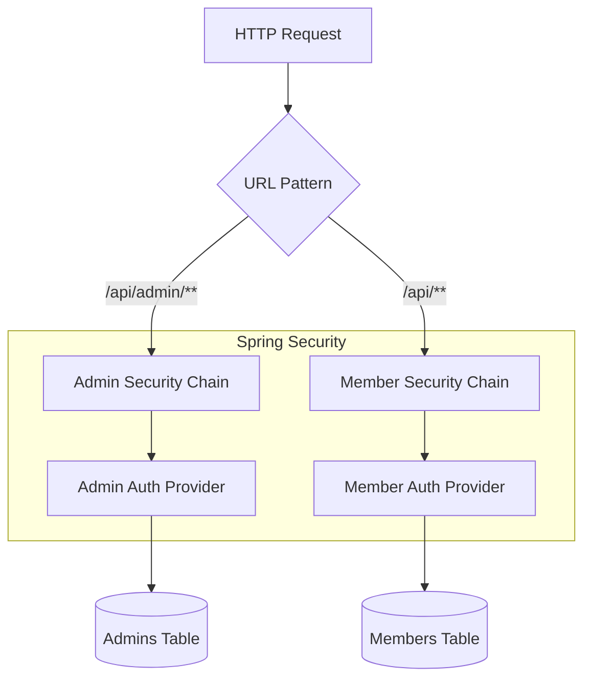

# 1. マルチチェーン認証アーキテクチャの採用

日付: 2026-01-02

## ステータス

承認済み

## 背景

現在、会員コンテキスト（Member）の認証機能を実装する必要がある。
将来的に、商品の登録や在庫管理を行う管理者ユーザー（Admin）の実装も予定されており、会員と管理者はコンテキストが異なり、格納されるテーブルも異なることが想定される。
これらを適切に分離しつつ、セキュアに認証・認可を行う基盤が必要である。

## 決定事項

Spring Securityの `SecurityFilterChain` を複数定義する「マルチチェーンアーキテクチャ」を採用する。

1. **URLによる分離**:
   - `/api/admin/**`: 管理者用
   - `/api/**` (その他): 会員用
2. **認証コンテキストの分離**:
   - 各チェーンで独立した `UserDetailsService` および `AuthenticationProvider` を構成する。
     - 会員用: `MemberUserDetailsService` (Memberテーブル参照)
     - 管理者用: `AdminUserDetailsService` (Adminテーブル参照)
3. **セッション管理**:
   - Cookieベースのセッション認証（JSESSIONID）を使用する。
   - CSRF対策として、SPAからのリクエストにはX-XSRF-TOKENヘッダ等の適切な対策を行う（またはSameSite属性の活用）。今回はまずはステートフルなセッション認証を基本とする。

## アーキテクチャ図

## 代替案

- **シングルチェーン + 共通Userテーブル**:
  - 会員と管理者を同じテーブルで管理し、Roleで区別する。
  - **却下理由**: コンテキストが明確に異なるため、データを混在させるのはDDDの観点から好ましくない。
- **JWT (JSON Web Token)**:
  - ステートレスな認証。
  - **理由**: トークンの無効化（ログアウト）の管理や、クライアント側でのトークン保持のセキュリティリスク（XSS等）を考慮し、Spring Security標準のセッション管理の方が堅牢かつ実装コストが低いと判断したため。

## 結果

- **メリット**:
  - 会員と管理者の認証ロジックが混ざらず、保守性が高い。
  - 将来的な管理画面の実装時に、会員側のコードに影響を与えずに追加できる。
- **デメリット**:
  - `SecurityConfig` の設定が若干複雑になる（複数のFilterChain定義が必要）。
