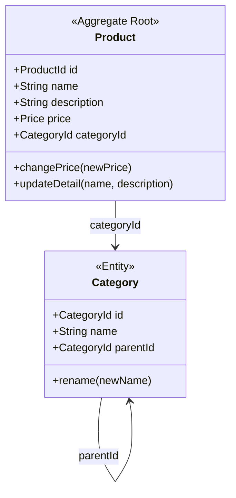
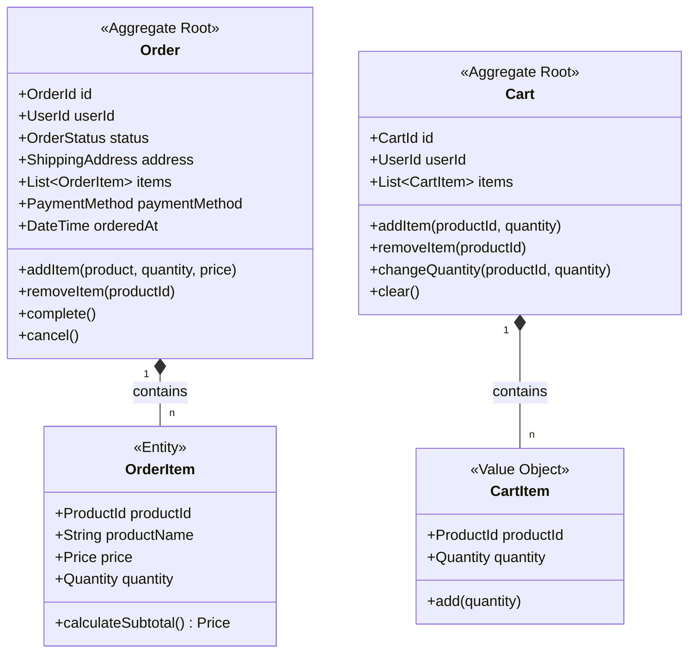
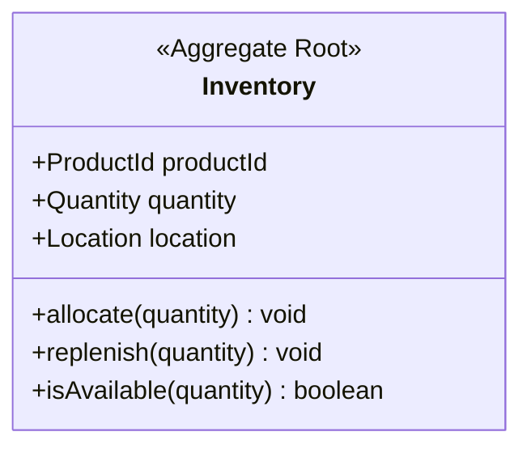
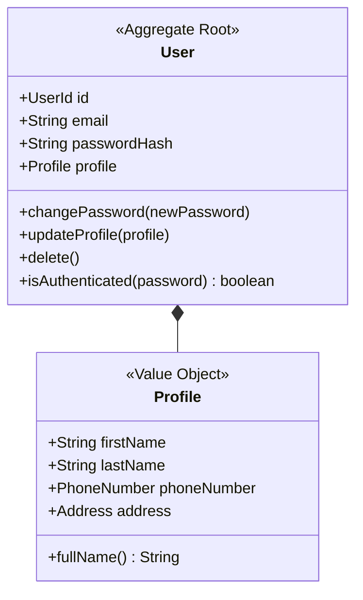

# ドメインモデル (Domain Models)

各コンテキストのドメインモデルを定義します。データだけでなく振る舞い（メソッド）を持たせ、ドメイン貧血症を防ぎます。

## 凡例
- `<<Aggregate Root>>`: 集約ルート。整合性の境界。
- `<<Entity>>`: 識別子を持つオブジェクト。
- `<<Value Object>>`: 値によって識別されるオブジェクト。

## 1. 商品コンテキスト (Product Context)

## 2. 注文コンテキスト (Order Context)

## 3. 在庫コンテキスト (Inventory Context)

## 4. 会員コンテキスト (User Context)

